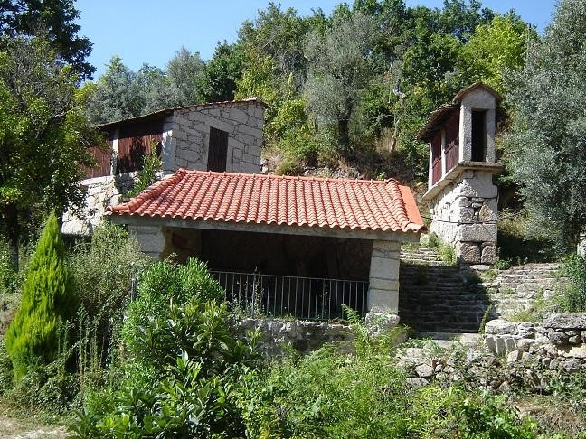
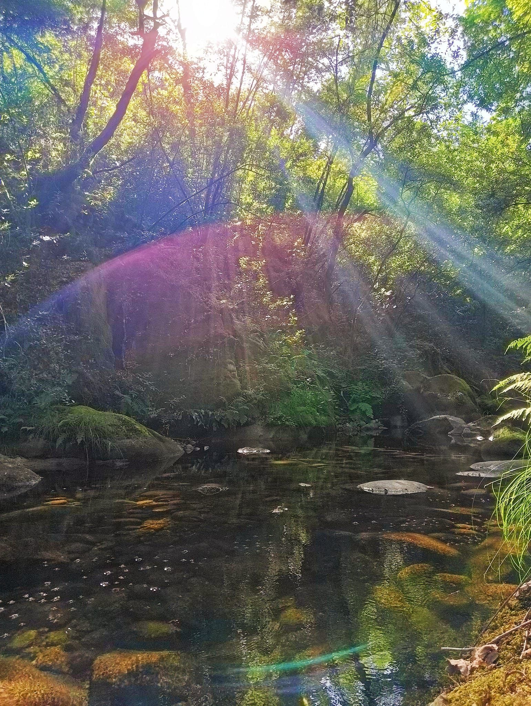
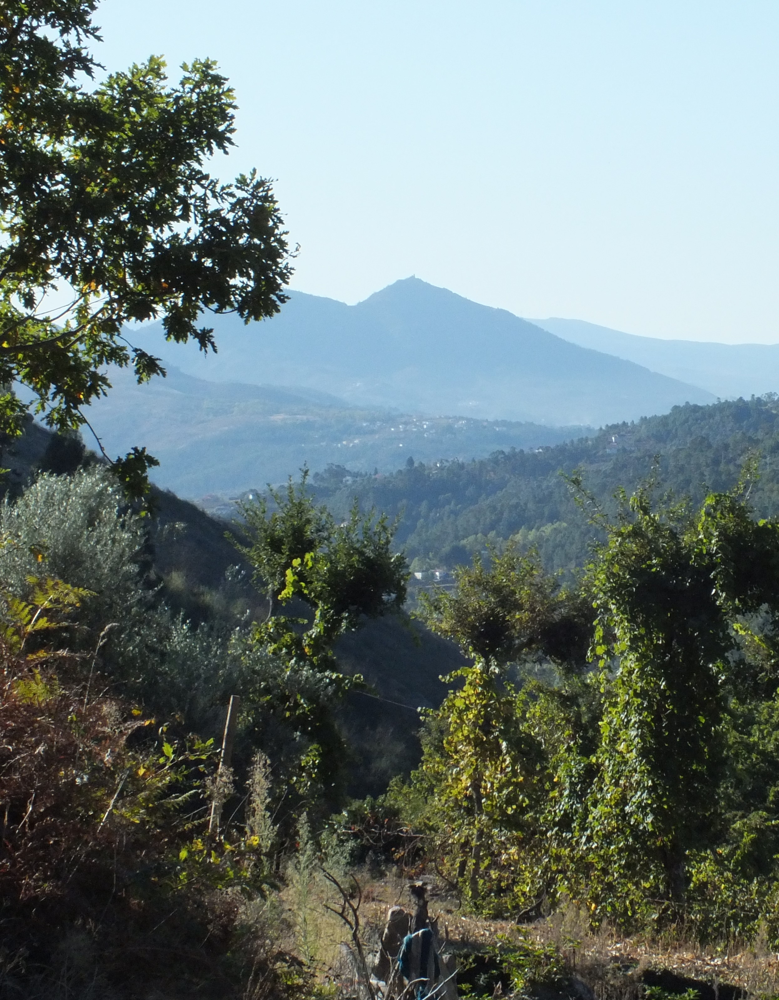

# Bienvenid@ a Ecoaldea Espiral

Un lugar donde la energía, la magia y el amor se encuentran

## Acerca de

Una tierra mágica,
que recibe la energía de las 5 pirámides naturales que la rodean,
de los cuarzos que hay y que expanden su energía sanadora y de transformación,
del bosque, del río, las pozas, los riachuelos, los nacimientos naturales de agua
y de los seres mágicos nos acompañan,
compartiendo el amor y las sabidurías.

[Más información](el-lugar.md)

## Proyecto

Nuestro camino se mueve al encuentro, en 7 direcciones:
la autosuficiencia,
el respeto a la infancia,
la vida en comunidad,
una alimentación respetuosa,
la sanación,
la ecología
y el amor y donde nos sintamos libres,
cuidando y sanando nuestras relaciones con la naturaleza
y entre las personas.

[Más información](proyecto-base.md)

## Visitas

Donde podrás ver la vida en un mundo diferente
y podrás experimentar y sentir un ambiente de paz,
de calma y donde tod@s nos ayudamos
haciéndonos la vida más fácil, segura y feliz.

[Más información](visitas/index.md)

**TODO** integrar el Video!

## Integraciones

Si esta vida te gusta,
tienes la opción de hacer de este sitio tu hogar,
viviendo en la ecoaldea como semilla
y formando parte de las decisiones,
la vida y el desarrollo de la misma.

[Más información](integracion.md)

---

[Contacto][contacto]

---

Todos los derechos reservados © Ecoaldea Espiral

Un lugar donde la energía, la magia y el amor se encuentran

[contacto]: contacto.md
